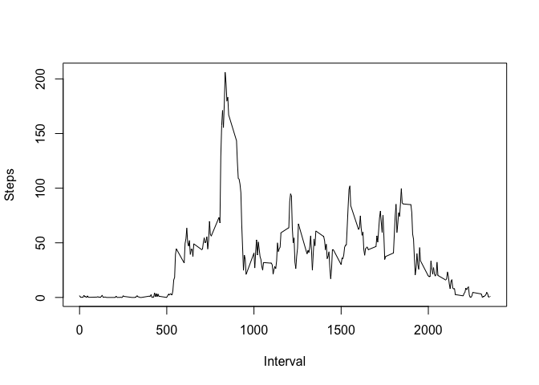

## Loading and preprocessing the data

```r
setwd("~/Desktop/RepData_PeerAssessment1")
activity <- unzip("activity.zip")
activity <- read.csv("activity.csv")
library(dplyr)
library(lattice)
```


## What is mean total number of steps taken per day?

```r
# For this part of the assignment, you can ignore the missing values in the dataset.
no_na <- activity[!(is.na(activity$steps)),] # Subset out NAs; even without this code, hist() would have ignored NAs.
dates <- unique(no_na$date) # Identify separate days
steps_per_day <- vector("numeric") # Empty accumulator
for (i in dates) { 
  temp_date <- no_na[no_na$date==i,] 
  steps_per_day <- c(steps_per_day, sum(temp_date$steps)) # Accumulating total steps per day
}

# Plot histogram of total steps per day
hist(steps_per_day) 
```

<!-- -->

```r
summary(steps_per_day)[3] #Median
```

```
## Median 
##  10765
```

```r
summary(steps_per_day)[4] #Mean
```

```
##     Mean 
## 10766.19
```

## What is the average daily activity pattern?

```r
# Make time series plot(i.e. type="1") of the 5-minute interval(x-axis) and the average number of steps taken, averaged across all days(y-axis).
x <- unique(activity$interval)
per_int <- vector("numeric") # Accumulator
for (i in x) { 
  temp_int <- no_na[no_na$interval==i,]
  per_int <- c(per_int, mean(temp_int$steps)) # Accumulating average steps per interval
}

plot(per_int ~ x, type=c("l"), xlab="Interval", ylab="Steps") # Plotting average steps per interval
```

<!-- -->

```r
# Which 5-min interval, on average across all the days in the dataset, contains the max number of steps?
x[which(per_int %in% max(per_int))]
```

```
## [1] 835
```


## Imputing missing values


```r
# Presence of missing days may introduce bias into some calculations or summaries of the data.

# Calculate and report the total number rows with NAs.
length(activity[is.na(activity$steps),]$steps)
```

```
## [1] 2304
```

```r
# Devise a strategy for filling in all of the missing values in the dataset.

# Create a new dataset that is equal to the original dataset but with the missing data filled in.
filled_NAs <- activity
filled_NAs[is.na(filled_NAs$steps),]$steps <- 0

# Make a histogram of the total number of steps taken each day. Calculate and report the mean and median total number of steps taken per day.
steps_per_day2 <- vector("numeric") # Accumulator
dates2 <- unique(filled_NAs$date)
for (i in dates2) {
  temp_date2 <- filled_NAs[filled_NAs$date==i,]
  steps_per_day2 <- c(steps_per_day2, sum(temp_date2$steps)) # Accumulating total steps per day
}

# Plot histogram
hist(steps_per_day2)
```

<!-- -->

```r
summary(steps_per_day2)[3] #Median
```

```
## Median 
##  10395
```

```r
summary(steps_per_day2)[4] #Mean
```

```
##    Mean 
## 9354.23
```

```r
# Do these values differ from the estimates from the first part of the assignment? What is the impact of imputing missing data on the estimates of the total daily number of steps?
summary(steps_per_day2)[3] - summary(steps_per_day)[3] #Median diff
```

```
## Median 
##   -370
```

```r
summary(steps_per_day2)[4] - summary(steps_per_day)[4] #Mean diff
```

```
##      Mean 
## -1411.959
```

## Are there differences in activity patterns between weekdays and weekends?

```r
# Create a new factor variable in the dataset with two levels - "weekday" and
# "weekend" indicating whether a given date is a weekday or weekend day.
weektypes <- weekdays(as.POSIXct(activity$date)) # Classifying all weektype data as "weekday" or "weekend"
for (i in 1:length(weektypes)) { # Sorting dates into a new column called "weektype"
  if (weektypes[i] == "Saturday" | weektypes[i] == "Sunday") {
    activity$weektype[i] <- "weekend"
  } else {
    activity$weektype[i] <- "weekday"
  }
}

# Make a panel plot containing a time series plot(i.e. type=="l") of the 5-min interval(x-axis) and the average number of steps taken, averaged across all weekday days or weekend days (y-axis). 
no_na2 <- activity[!(is.na(activity$steps)),] # Subset out NAs
weekend_per_int <- vector("numeric") # Accumulator for "weekends"
weekday_per_int <- vector("numeric") # Accumulator for "weekdays"
no_na2$int_avg <- no_na2$steps
for (i in x) {
  weekend_per_int <- c(weekend_per_int, mean(no_na2[no_na2$weektype=="weekend" & no_na2$interval==i,]$steps)) # Accumulating average steps for each interval and weektype
  weekday_per_int <- c(weekday_per_int, mean(no_na2[no_na2$weektype=="weekday" & no_na2$interval==i,]$steps))
}

# The following code creates a new data frame "weeks" with columns for weektype, interval, and average steps per interval
weekend <- data.frame(per_int = weekend_per_int, weektype="weekend", interval=x)
weekday <- data.frame(per_int = weekday_per_int, weektype="weekday", interval=x)
weeks <- bind_rows(weekend, weekday)
```

```
## Warning in bind_rows_(x, .id): Unequal factor levels: coercing to character
```

```
## Warning in bind_rows_(x, .id): binding character and factor vector,
## coercing into character vector

## Warning in bind_rows_(x, .id): binding character and factor vector,
## coercing into character vector
```


```r
xyplot(per_int~interval|weektype, data=weeks, type="l", 
       xlab="Interval", ylab="Average Steps-per-day")
```

<!-- -->
